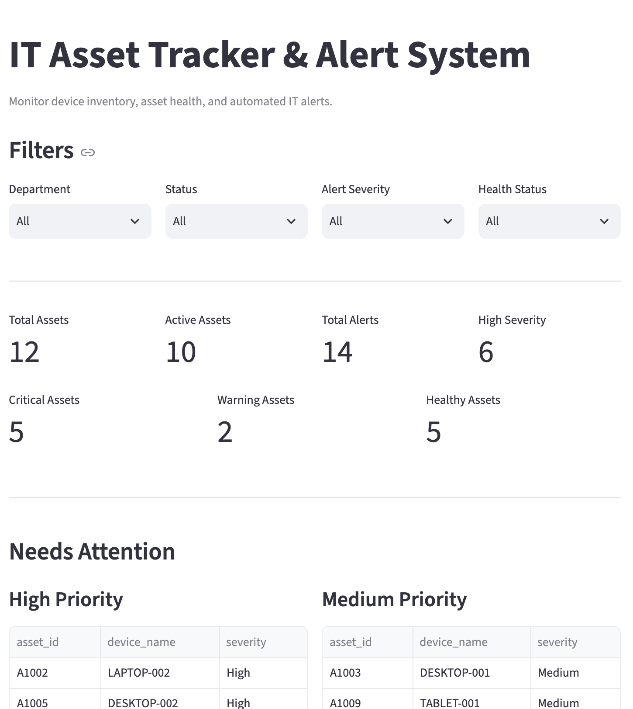
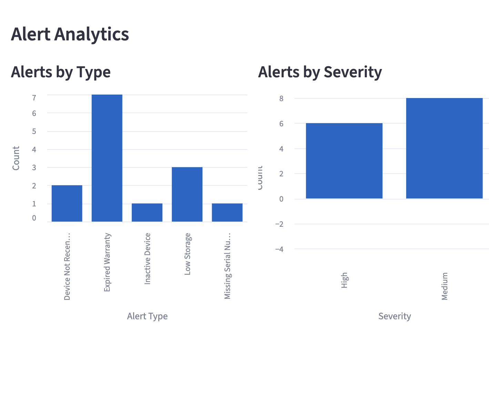
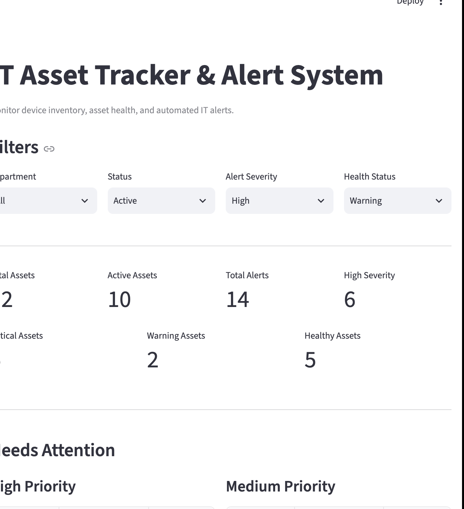
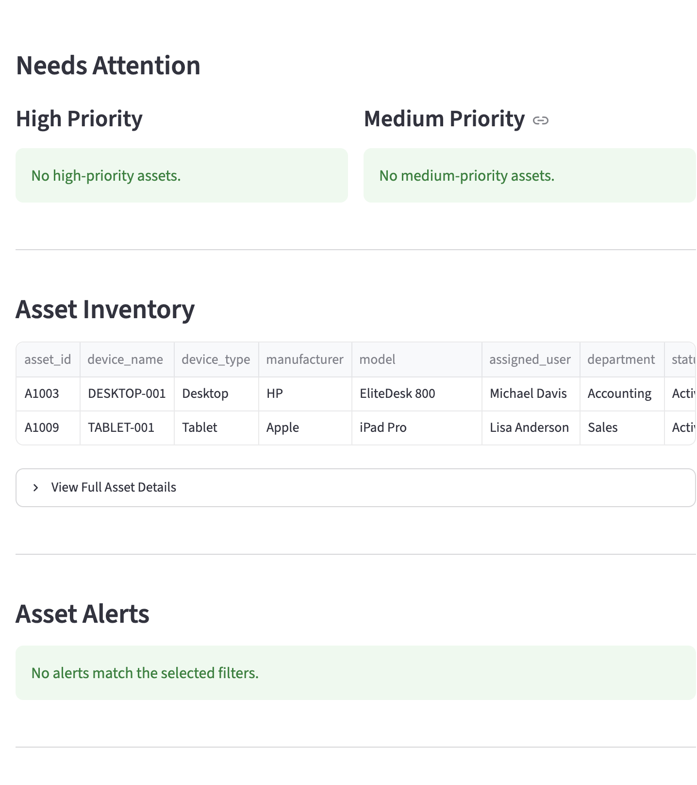

# IT Asset Tracker & Alert System

A Python-based IT asset tracking and alert system built with SQLite, Streamlit, and Pandas to monitor device inventory, evaluate asset health, and automatically flag potential IT issues.

## Features

- Track IT assets such as laptops, desktops, tablets, and other devices
- Store cleaned asset inventory data in SQLite
- Automatically detect:
  - Expired warranties
  - Low storage
  - Inactive devices
  - Devices not recently seen
  - Missing serial numbers
- Assign overall asset health statuses:
  - Critical
  - Warning
  - Healthy
- Filter assets by:
  - Department
  - Status
  - Alert severity
  - Health status
- View high-priority and medium-priority devices
- Display color-coded asset health indicators
- Analyze alert trends with interactive Streamlit charts
- View detailed asset information through an expandable dashboard section

## Tech Stack

- Python
- Pandas
- SQLite
- Streamlit
- Git / GitHub

- ## Project Architecture

```text
it-asset-tracker/
├── data/
│   └── assets.csv
├── database/
│   └── assets.db
├── scripts/
│   ├── clean_assets.py
│   ├── generate_alerts.py
│   └── database.py
├── app.py
├── requirements.txt
├── README.md
└── .gitignore

## How It Works

## Installation

Clone the Repository:
git clone https://github.com/LilTeo48/it-asset-tracker.git
cd it-asset-tracker

Create a virtual environment:
python3 -m venv .venv
source .venv/bin/activate

Install Dependencies:
pip install -r requirements.txt

## Running the Project

Generate the SQLite Database:
python3 scripts/database.py

Launch the Streamlit dashboard:
streamlit run app.py

## Screenshots

## Screenshots

### Dashboard Overview


### Interactive Filtering


### Asset Inventory


### Alert Analytics



## Example Alerts

The system can generate alerts such as:

- Expired Warranty
- Low Storage
- Inactive Device
- Device Not Recently Seen
- Missing Serial Number

Alert severity levels include:

- High
- Medium
- Low

## Future Improvements

- Add automated unit tests
- Add support for importing larger enterprise asset datasets
- Add user authentication and role-based access
- Add email or Slack notifications for critical alerts
- Add asset risk scoring
- Add historical alert tracking
- Deploy the dashboard for public portfolio access
